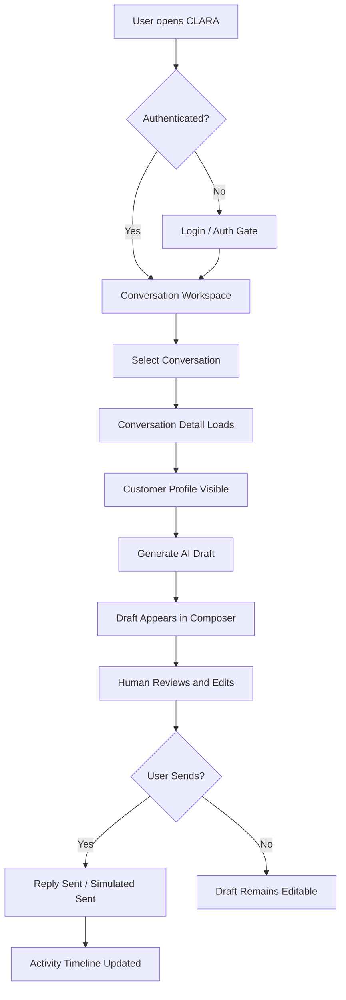

# CLARA MVP First Product Slice UX Flow + UI Spec

## Unified Customer Conversation Inbox + AI-Assisted Reply Draft

---

# 1. Product UX Summary

The MVP UI provides one focused workspace where a sales/support operator can:

```text
view customer conversations
open a conversation
read the message history
inspect customer profile/context
generate an AI-assisted reply draft
edit the draft
send manually
view basic activity
```

---

# 2. Primary Layout Decision

Use a three-panel desktop layout:

```text
┌──────────────────────┬──────────────────────────────────────┬──────────────────────┐
│ Conversation Inbox   │ Conversation Detail                   │ Customer Profile      │
│ filters/search/list  │ messages + composer + AI draft        │ profile + activity    │
└──────────────────────┴──────────────────────────────────────┴──────────────────────┘
```

---

# 3. Primary Screens

```text
1. Login / Auth Gate
2. Conversation Workspace
3. Conversation Detail
4. Customer Profile Sidebar
5. Reply Composer with AI Draft
6. Activity Timeline
7. Error / Empty / Loading States
```

For MVP, screens 2–6 can live in one workspace route.

---

# 4. Primary User Flow



---

# 5. UX Non-Negotiables

The UI must enforce:

```text
AI draft is visibly a draft
send requires explicit user click
viewer cannot access draft/send actions
loading and error states are recoverable
manual reply is always available if AI fails
customer context is visible before send
no secrets/internal errors shown to user
```

---

# 6. Main Interaction Pattern

## Select Conversation

User clicks a row in the inbox.

Expected result:

```text
conversation row becomes selected
center panel loads messages
right panel loads customer profile
composer resets to conversation-specific state
```

## Generate AI Draft

User clicks:

```text
Generate AI Draft
```

Expected result:

```text
button enters loading state
draft appears in composer
draft is editable
AI label is shown
send button remains manual
```

## Send Reply

User clicks:

```text
Send Reply
```

Expected result:

```text
reply is sent/simulated
composer clears
outgoing message appears
activity timeline updates
```

---

# 7. MVP UI States

```text
default
selected conversation
empty inbox
loading inbox
loading conversation
AI generating
AI draft ready
AI draft failed
reply sending
reply sent
reply failed
forbidden action
```

---

# 8. Design Constraints

```text
desktop-first MVP
tablet-friendly if practical
mobile optimization out of MVP
no advanced CRM editor
no full admin management
no autonomous AI
no bulk messaging
```

---

# 9. Acceptance Summary

The UX is accepted when:

```text
agent can complete reply flow end-to-end
viewer cannot send or generate AI draft
AI draft cannot be confused with sent message
manual reply is possible without AI
customer profile is visible during reply composition
safe error states exist
wireframes are clear enough for implementation
```
