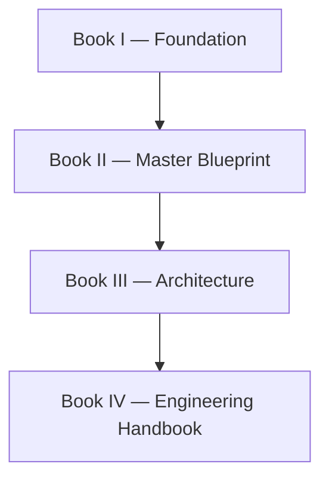

# Athena Documentation Standard (ADS)

> *"Documentation is architecture made visible."*

---

## Document Information

| Field | Value |
|------|-------|
| Standard | Athena Documentation Standard |
| Short Name | ADS |
| Version | 1.0.0 |
| Status | Official |
| Owner | Athena Core Team |
| Scope | Athena Engineering Library |
| Last Updated | 2026-07-06 |

---

# Purpose

The Athena Documentation Standard defines the official structure, style, metadata, naming convention, and quality expectations for all documentation within the Athena Engineering Library.

This standard exists to ensure that every document in Athena is:

- Consistent.
- Maintainable.
- Searchable.
- Reviewable.
- AI-readable.
- Production-ready.
- Easy to navigate.
- Easy to evolve.

Athena documentation is not treated as an afterthought.

Documentation is a first-class engineering artifact.

---

# Scope

ADS applies to all official Athena documentation, including:

- Books.
- Chapters.
- Architecture documents.
- Blueprint documents.
- Domain specifications.
- Service specifications.
- AI specifications.
- API specifications.
- Product requirements.
- Technical design documents.
- Architecture Decision Records.
- Security checklists.
- Runbooks.
- Test plans.
- Contributor guides.
- Operational guides.

If a document explains how Athena is designed, built, operated, secured, or evolved, it should follow ADS unless explicitly exempted.

---

# Core Principles

ADS is based on the following principles.

## 1. Documentation Before Implementation

Important work should be documented before implementation begins.

Code explains how a system works.

Documentation explains why the system exists and why it was designed that way.

---

## 2. Clarity Before Complexity

Documentation should be easy to understand.

Avoid unnecessary jargon.

Prefer simple language.

Explain complex ideas step by step.

A document is successful when future contributors can understand the reasoning without asking the original author.

---

## 3. Consistency Before Personal Style

Athena documentation should feel like one unified library.

Individual writing preferences should not override the shared documentation structure.

Consistency improves readability, review quality, onboarding, and AI-assisted development.

---

## 4. Navigation is Part of Documentation

Every document should help readers understand where they are, what came before, what comes next, and which documents are related.

Documentation should behave like a connected system, not isolated files.

---

## 5. Principles Before Tools

ADS does not depend on a specific documentation platform.

Athena documentation should work in:

- GitHub.
- GitLab.
- MkDocs.
- Docusaurus.
- GitBook.
- Static site generators.
- AI coding assistants.

Markdown is the default source format.

---

# Required Document Structure

Every major Athena document should follow this structure unless the document type has a specialized template.

```md
---
book: ""
part: ""
chapter: ""
title: ""
version: "1.0.0"
status: "draft"
owner: "Athena Core Team"
last_updated: "YYYY-MM-DD"
classification: ""
previous: ""
next: ""
---

# Title

> Opening quote.

---

## Table of Contents

---

## Purpose

---

## Goals

---

## Scope

---

## Overview

---

## Main Content

---

## Dependencies

---

## Future Evolution

---

## Key Takeaways

---

## Related Documents

---

## References

---

## Navigation
```

---

# Frontmatter Standard

All major documents must include YAML frontmatter.

Example:

```yaml
---
book: "Book II — Master Blueprint"
part: "PART-01 — Platform Vision"
chapter: "01"
title: "Executive Overview"
version: "1.0.0"
status: "draft"
owner: "Athena Core Team"
last_updated: "2026-07-06"
classification: "blueprint"
previous: "./README.md"
next: "./02-Athena-Big-Picture.md"
---
```

## Required Frontmatter Fields

| Field | Required | Description |
|------|----------|-------------|
| book | Yes | Book name |
| part | Conditional | Required for books with parts |
| chapter | Conditional | Required for chapter documents |
| title | Yes | Document title |
| version | Yes | Semantic version |
| status | Yes | Document status |
| owner | Yes | Responsible team |
| last_updated | Yes | Last update date |
| classification | Yes | Document type |
| previous | Recommended | Previous document |
| next | Recommended | Next document |

---

# Status Values

Use one of the following status values:

| Status | Meaning |
|------|---------|
| draft | Work in progress |
| review | Ready for review |
| official | Approved official version |
| deprecated | No longer recommended |
| archived | Preserved for historical reference |

---

# Classification Values

Use one of the following classification values:

| Classification | Description |
|---------------|-------------|
| foundation | Philosophical or constitutional document |
| blueprint | Master planning document |
| architecture | Architecture document |
| engineering | Engineering practice document |
| ai | Artificial intelligence document |
| security | Security document |
| operations | Operations or runbook document |
| product | Product strategy or PRD document |
| api | API specification |
| data | Data design document |
| governance | Governance document |
| template | Documentation template |
| reference | Reference document |

---

# File Naming Standard

Files must use numbered, descriptive, kebab-case names.

## Correct

```text
01-Executive-Overview.md
02-Athena-Big-Picture.md
12-Architecture-Principles.md
```

## Incorrect

```text
chapter1.md
overview.md
new_file.md
ExecutiveOverview.md
```

Use numbers to preserve reading order.

Use English file names.

Use `.md` for Markdown source files.

---

# Folder Naming Standard

Folders must use uppercase part prefixes and descriptive kebab-case names.

## Correct

```text
BOOK-02-Master-Blueprint/
PART-01-Platform-Vision/
PART-03-Business-Domains/
```

## Incorrect

```text
book2/
part1/
platform vision/
BusinessDomains/
```

---

# Heading Standard

Use heading levels sequentially.

Do not skip heading levels.

## Correct

```md
# Title

## Section

### Subsection
```

## Incorrect

```md
# Title

### Subsection
```

Use Title Case for headings.

Keep headings clear and searchable.

---

# Writing Style

Athena documentation should use professional English.

Prefer:

- Short sentences.
- Clear explanations.
- Direct language.
- Explicit assumptions.
- Practical examples.
- Structured sections.
- Consistent terminology.

Avoid:

- Unnecessary hype.
- Ambiguous claims.
- Overly clever wording.
- Undefined acronyms.
- Vendor-specific assumptions unless required.
- Implementation detail inside high-level blueprint documents.

---

# Required Sections

## Purpose

Every document must explain why it exists.

The reader should understand the document's value within the first section.

---

## Goals

List the outcomes the document is intended to achieve.

Example:

```md
## Goals

- Define the platform capability.
- Explain its role in Athena.
- Identify dependencies.
- Establish future evolution direction.
```

---

## Scope

Every document should explain what is included and what is excluded.

Example:

```md
## Scope

This document covers the conceptual blueprint.

This document does not define database schema, API contracts, or deployment details.
```

---

## Overview

Provide a concise summary before going into detail.

The overview helps new readers understand the big picture.

---

## Dependencies

Every document should identify related systems, domains, services, or documents.

Example:

```md
## Dependencies

- Identity
- Authorization
- Event Bus
- Audit
- Notification
```

---

## Future Evolution

Every major document should include future direction.

Athena is designed for long-term evolution.

Documentation should preserve that intent.

---

## Key Takeaways

End major documents with concise takeaways.

Example:

```md
## Key Takeaways

- Athena is designed as one platform, not isolated products.
- The Organization Layer is foundational.
- All modules depend on Identity and Authorization.
```

---

## Related Documents

Link to nearby or supporting documents.

Example:

```md
## Related Documents

- ../README.md
- ../PART-02-Organization-Layer/11-Organization.md
- ../PART-05-Platform-Services/59-Event-Bus.md
```

---

## Navigation

Every chapter should include previous and next navigation links.

Example:

```md
## Navigation

**Previous:** [README](./README.md)

**Next:** [02-Athena-Big-Picture](./02-Athena-Big-Picture.md)
```

---

# Diagram Standard

Mermaid is the default diagram format.

Prefer Mermaid over PNG when possible.

## Allowed Diagram Types

- Flowchart
- Sequence diagram
- Entity relationship diagram
- State diagram
- C4-style architecture diagram
- Timeline
- Mind map

## Example



## Diagram Rules

- Keep diagrams readable.
- Avoid overly large diagrams.
- Use clear labels.
- Prefer business meaning over technical noise.
- Store reusable diagrams in `assets/diagrams/` or `diagrams/`.

---

# Blueprint Document Rules

Blueprint documents define what Athena will build.

They should not go too deep into implementation.

Blueprint documents may include:

- Purpose.
- Scope.
- System role.
- High-level components.
- Business capabilities.
- Dependencies.
- Interactions.
- Risks.
- Future evolution.

Blueprint documents should avoid:

- Database schema.
- Final API contract.
- Framework-specific implementation.
- Deployment manifests.
- Low-level code details.

Those belong in later books or technical specifications.

---

# Domain Document Rules

Domain documents should explain a business domain.

They should include:

- Domain purpose.
- Business problem.
- Core responsibilities.
- Main entities.
- Business flows.
- Dependencies.
- Related platform services.
- Future evolution.

Example domains:

- CRM.
- Customer.
- Communication.
- Knowledge.
- Workflow.
- Billing.
- HR.

---

# Service Document Rules

Service documents should explain reusable platform services.

They should include:

- Service purpose.
- Responsibilities.
- Consumers.
- Inputs and outputs.
- Events.
- Dependencies.
- Security considerations.
- Observability expectations.
- Failure modes.
- Future evolution.

Example services:

- Notification.
- Search.
- Audit.
- Event Bus.
- Queue.
- Scheduler.
- Storage.
- Cache.

---

# AI Document Rules

AI documents should describe AI capability at the platform level.

They should include:

- AI responsibility.
- Human oversight.
- Context usage.
- Tool usage.
- Data boundaries.
- Security boundaries.
- Evaluation approach.
- Observability.
- Failure handling.
- Governance.

AI documents should not hard-code dependency on one AI provider unless explicitly required.

---

# Security Document Rules

Security documents should include:

- Threat assumptions.
- Trust boundaries.
- Identity model.
- Authorization model.
- Data protection.
- Audit requirements.
- Abuse cases.
- Failure modes.
- Secure defaults.
- Operational controls.

Security must be treated as architecture, not a checklist added later.

---

# API Document Rules

API documents should include:

- Purpose.
- Consumers.
- Authentication.
- Authorization.
- Request structure.
- Response structure.
- Error format.
- Versioning.
- Rate limiting.
- Security considerations.
- Examples.

APIs are user interfaces for developers.

They must be designed with clarity and consistency.

---

# ADR Document Rules

Architecture Decision Records should include:

- Status.
- Context.
- Problem.
- Options considered.
- Decision.
- Consequences.
- Trade-offs.
- Related documents.

ADRs should be concise but complete.

They should preserve why a decision was made.

---

# Versioning Standard

Athena documents follow semantic versioning.

```text
MAJOR.MINOR.PATCH
```

## MAJOR

Use for breaking conceptual changes.

Example:

```text
1.0.0 → 2.0.0
```

## MINOR

Use for meaningful additions that do not break existing meaning.

Example:

```text
1.0.0 → 1.1.0
```

## PATCH

Use for typo fixes, formatting fixes, or non-semantic corrections.

Example:

```text
1.0.0 → 1.0.1
```

---

# Review Checklist

Before a document is merged, verify:

- [ ] Frontmatter is complete.
- [ ] Title is clear.
- [ ] Purpose is defined.
- [ ] Scope is explicit.
- [ ] Terminology matches the glossary.
- [ ] Dependencies are listed.
- [ ] Related documents are linked.
- [ ] Navigation is included.
- [ ] Diagrams are readable.
- [ ] No unnecessary implementation detail appears in blueprint docs.
- [ ] Security implications are considered.
- [ ] Future evolution is described.
- [ ] Key takeaways are included.
- [ ] Markdown formatting is valid.

---

# Documentation Philosophy

Athena documentation follows these beliefs:

```text
Documentation > Implementation Notes

Clarity > Cleverness

Business Meaning > Technical Noise

Architecture > Frameworks

Principles > Trends

Long-Term Value > Short-Term Convenience

Consistency > Personal Style
```

---

# Final Standard

All Athena documentation should be written as if it will be read by:

- A future engineer maintaining the system.
- A security reviewer evaluating risk.
- A product manager defining scope.
- An AI coding assistant grounding implementation.
- A new contributor joining the project.
- An organization depending on Athena.

Documentation is not complete when it is written.

Documentation is complete when it helps others make better decisions.

---

# Navigation

**Related:**

- `chapter-template.md`
- `part-template.md`
- `domain-template.md`
- `service-template.md`
- `adr-template.md`
