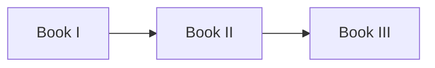

# Athena Cross-Reference Standard

> *"Documentation becomes a library when every document knows how to find the others."*

---

## Document Information

| Field | Value |
|---|---|
| Document | Athena Cross-Reference Standard |
| Version | 1.0.0 |
| Status | Official |
| Owner | Athena Core Team |
| Scope | Athena Engineering Library |
| Last Updated | 2026-07-06 |

---

# Purpose

This standard defines how documents reference one another throughout the Athena Engineering Library.

Cross-references improve:

- Navigation
- Traceability
- Reviewability
- Discoverability
- AI grounding
- Long-term maintainability

Documentation should behave as a connected knowledge graph rather than isolated Markdown files.

---

# Core Principles

1. Every important document should link to related documents.
2. Use relative links whenever possible.
3. References should describe relationships, not merely list files.
4. Avoid duplicated explanations—link to the source of truth.

---

# Types of References

## Navigation References

Every chapter should contain:

```md
## Navigation

**Previous:** ...

**Next:** ...
```

---

## Related Documents

Include nearby or dependent documents.

Example:

```md
## Related Documents

- ../README.md
- ../GLOSSARY.md
- ../PART-02-Organization-Layer/11-Organization.md
```

---

## Dependency References

When a document depends on another concept:

```md
## Dependencies

- Identity
- Authorization
- Event Bus
- Audit Service
```

Where appropriate, use links instead of plain text.

---

## Standards References

When applying an Athena standard:

```md
This document follows:

- ADS.md
- STYLE-GUIDE.md
- NAMING-CONVENTION.md
- SECURITY-DOCS-STANDARD.md
```

---

# Relative Link Rules

Prefer relative paths.

Good:

```text
../README.md
../GLOSSARY.md
../PART-04-AI-Platform/46-Context-Engine.md
```

Avoid absolute repository URLs inside internal documentation.

---

# Book References

When referencing another book, include the book and chapter.

Example:

```text
Book I → Chapter 12 — Architecture Principles
Book II → PART IV → Context Engine
Book III → Identity Architecture
```

---

# Source of Truth

Never duplicate canonical content.

Instead:

- Keep one authoritative document.
- Link to it from dependent documents.
- Update only the source of truth.

---

# Mermaid Relationship Maps

Large topics may include relationship diagrams.

Example:



---

# AI Readability

Cross-references should help AI assistants discover context.

Prefer explicit section names over vague phrases like "see above".

---

# Review Checklist

- [ ] Links use relative paths.
- [ ] Broken links removed.
- [ ] Related documents included.
- [ ] Source of truth identified.
- [ ] No duplicated canonical content.
- [ ] Navigation updated.

---

# Anti-Patterns

Avoid:

- Copying the same specification into multiple files.
- Linking to outdated documents.
- Circular references without explanation.
- "See another file" without identifying which file.

---

# Final Rule

Every document should answer two questions:

1. Where did this knowledge come from?
2. Where should the reader go next?

If those answers are missing, the documentation graph is incomplete.

---

# Navigation

**Related Standards**

- ADS.md
- STYLE-GUIDE.md
- DOCUMENT-LIFECYCLE.md
- GLOSSARY-STANDARD.md
