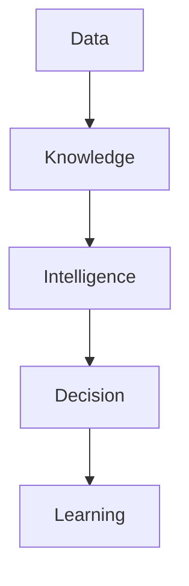
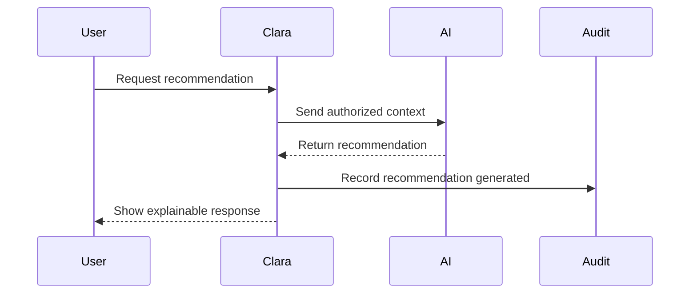
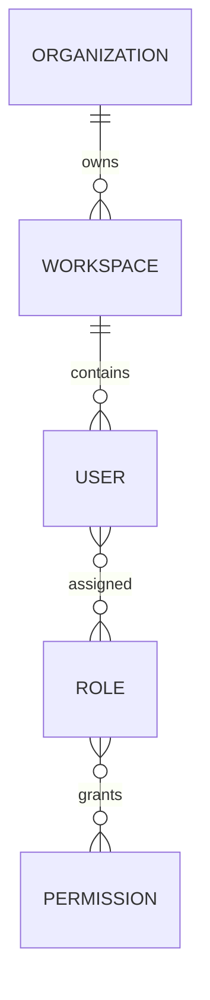
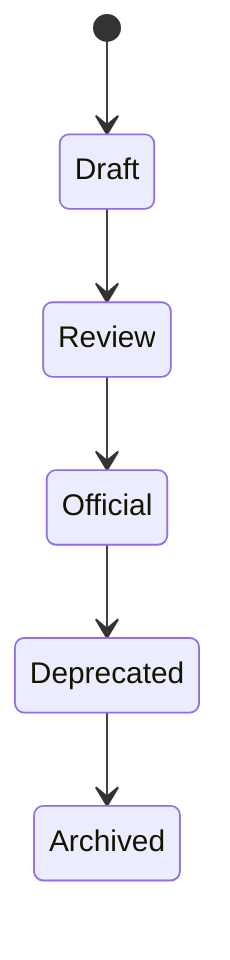
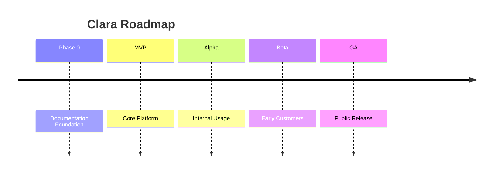
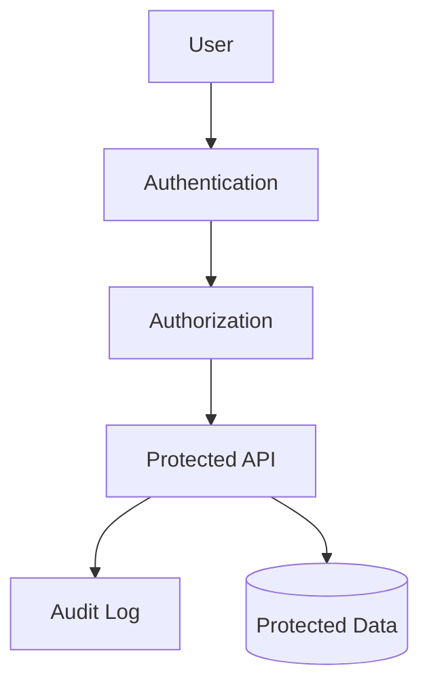
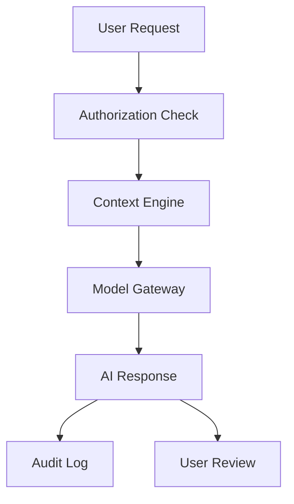
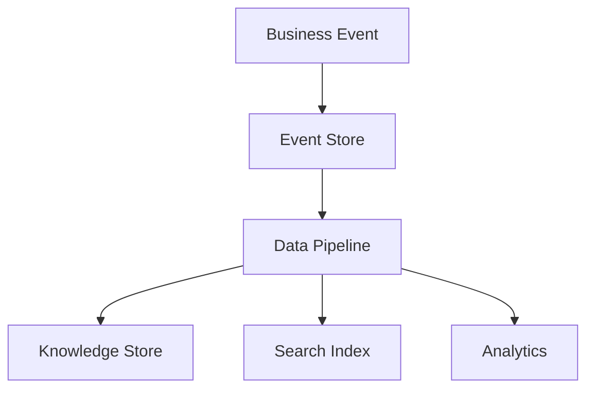
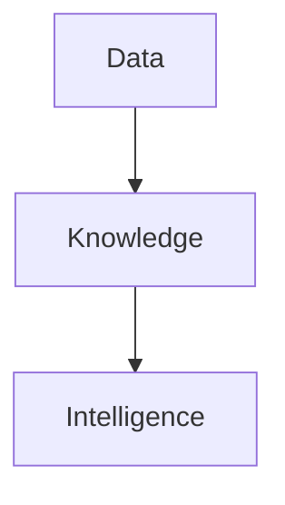

# Clara Diagram Standard

> *"A good diagram reduces the amount of explanation required to understand a system."*

---

## Document Information

| Field | Value |
|------|-------|
| Document | Clara Diagram Standard |
| Version | 1.0.0 |
| Status | Official |
| Owner | Clara Core Team |
| Scope | Clara Engineering Library |
| Last Updated | 2026-07-06 |

---

# Purpose

This document defines the official diagram standards for the Clara Engineering Library.

Diagrams help contributors understand systems, domains, workflows, dependencies, trust boundaries, and architectural decisions faster than text alone.

Clara diagrams should be:

- Clear.
- Consistent.
- Maintainable.
- Reviewable.
- Version-controlled.
- Easy to render.
- Easy for AI coding assistants to understand.

---

# Core Principle

Diagrams are documentation.

They must be treated with the same care as written architecture, product, engineering, security, and operational documents.

A diagram should clarify thinking, not decorate a document.

---

# Default Diagram Format

Clara uses **Mermaid** as the default diagram format.

Mermaid diagrams are preferred because they are:

- Text-based.
- Git-friendly.
- Easy to review in pull requests.
- Easy to update.
- Compatible with GitHub Markdown.
- Usable in MkDocs, Docusaurus, and GitBook.
- Readable by AI coding assistants.

Use image files only when Mermaid is insufficient.

---

# Folder Structure

Reusable diagrams should be stored in one of these folders:

```text
docs/
└── BOOK-XX-Book-Name/
    ├── diagrams/
    │   ├── platform-big-map.mmd
    │   ├── data-flow.mmd
    │   └── security-boundary.mmd
    │
    └── assets/
        └── diagrams/
            ├── exported-diagram.svg
            └── exported-diagram.png
```

Recommended structure:

```text
diagrams/        Source Mermaid files
assets/diagrams/ Exported images if needed
```

---

# File Naming

Diagram files must use kebab-case.

Use `.mmd` for Mermaid source files.

## Good

```text
platform-big-map.mmd
organization-layer-map.mmd
data-knowledge-intelligence-flow.mmd
ai-context-engine-flow.mmd
security-trust-boundary.mmd
decision-framework.mmd
```

## Avoid

```text
diagram1.mmd
new-flow.mmd
final-final.png
ArchitectureDiagram.svg
```

---

# When to Use Diagrams

Use diagrams when they clarify:

- System structure.
- Workflow.
- Domain relationships.
- Data lifecycle.
- Event flow.
- Security boundary.
- AI interaction.
- Deployment topology.
- Decision process.
- User journey.
- Dependency map.

Do not use diagrams when a short paragraph or table is clearer.

---

# Diagram Types

## Flowchart

Use for process flows, lifecycle flows, and high-level maps.



---

## Sequence Diagram

Use for interactions between users, services, APIs, agents, and external systems.



---

## Entity Relationship Diagram

Use for conceptual entity relationships.



---

## State Diagram

Use for object lifecycle states.



---

## Timeline

Use for roadmap or phase progression.



---

# Diagram Size Rules

Keep diagrams readable.

A diagram should ideally fit on one screen.

If a diagram becomes too large, split it into smaller diagrams.

## Prefer

```text
One high-level map
+
Several focused diagrams
```

## Avoid

```text
One giant unreadable diagram containing every service, database, queue, API, and UI.
```

---

# Labeling Rules

Use clear labels.

Labels should describe business meaning first.

## Good

```text
Customer Created
Workflow Completed
AI Recommendation Generated
Permission Granted
```

## Avoid

```text
Handler Runs
DB Update
Payload Sent
Process Step
```

---

# Direction Rules

Use consistent flow direction.

## Recommended

Use `TD` for top-down flows:

```mermaid
flowchart TD
```

Use `LR` for left-to-right flows:

```mermaid
flowchart LR
```

Choose based on readability.

Do not mix directions unnecessarily in the same diagram family.

---

# Styling Rules

Keep styling minimal.

Avoid excessive colors.

Use simple labels and clear structure.

Do not depend on color alone to communicate meaning.

If color is used, it must improve clarity.

Accessibility matters.

---

# Security Diagram Rules

Security diagrams should clearly show:

- Trust boundaries.
- Actors.
- Protected systems.
- External systems.
- Authentication points.
- Authorization checks.
- Sensitive data paths.
- Audit logging points.

Example:



Security diagrams should avoid hiding important risk boundaries.

---

# AI Diagram Rules

AI diagrams should clearly show:

- User request.
- Authorization.
- Context retrieval.
- AI provider or model gateway.
- Tool usage.
- Human approval when required.
- Audit logging.
- Output returned to user.

Example:



AI diagrams must not imply unauthorized access to data.

---

# Data Diagram Rules

Data diagrams should clearly show:

- Source of truth.
- Ownership.
- Data flow.
- Transformation.
- Storage.
- Indexing.
- Audit or lineage.
- Consumers.

Example:



Avoid diagrams that make data ownership ambiguous.

---

# Architecture Diagram Rules

Architecture diagrams should show logical responsibilities before technology choices.

## Prefer

```text
Identity Service
Authorization Service
Event Bus
Audit Service
Knowledge Store
```

## Avoid too early

```text
PostgreSQL
Kafka
Redis
Kubernetes
```

Technology-specific diagrams belong in implementation or infrastructure documents.

---

# Product Flow Diagram Rules

Product flow diagrams should show user intent and business outcomes.

Use product language, not code language.

## Good

```text
User Creates Customer
Customer Assigned to Sales
Sales Converts Lead
Workflow Starts Onboarding
```

## Avoid

```text
Button Click
Controller Called
Database Updated
```

---

# Diagram Caption Standard

Every diagram should have a short explanation before or after it.

Example:

```md
The following diagram shows how data becomes knowledge and then supports organizational intelligence.


```

Do not insert diagrams without context.

---

# Diagram References

When a diagram is reused across documents, store it as a separate `.mmd` file and reference it from the document.

Recommended:

```text
diagrams/data-knowledge-intelligence-flow.mmd
```

Avoid duplicating the same diagram in multiple files unless necessary.

---

# Diagram Review Checklist

Before merging a diagram, verify:

- [ ] The diagram has a clear purpose.
- [ ] The diagram is readable.
- [ ] Labels use business meaning.
- [ ] The flow direction is consistent.
- [ ] The diagram is not too large.
- [ ] Security boundaries are clear where relevant.
- [ ] Data ownership is clear where relevant.
- [ ] AI authorization boundaries are clear where relevant.
- [ ] The Mermaid syntax renders correctly.
- [ ] The file name follows naming conventions.
- [ ] The diagram is referenced by a document.
- [ ] The diagram does not expose secrets or sensitive information.

---

# Common Anti-Patterns

Avoid:

- Giant diagrams.
- Decorative diagrams with no useful meaning.
- Unlabeled arrows.
- Ambiguous boxes like `System`, `Service`, or `Data`.
- Mixing business and low-level infrastructure concepts in one diagram.
- Showing AI accessing data without authorization.
- Showing shared databases across domains without explaining ownership.
- Using screenshots as architecture documentation.
- Using colors as the only way to communicate meaning.

---

# Diagram Maintenance

Diagrams must be updated when architecture, workflow, domain ownership, or system behavior changes.

If a diagram becomes outdated, it should be fixed or removed.

Outdated diagrams are dangerous because they create false confidence.

---

# Recommended Diagram Set Per Book

## Book I — The Foundation

- Foundation flow.
- Data → Knowledge → Intelligence flow.
- Decision lifecycle.
- Security philosophy map.

## Book II — Master Blueprint

- Platform big map.
- Domain map.
- Product map.
- Organization layer map.
- AI platform map.
- Data platform map.
- Security platform map.
- Infrastructure map.
- Roadmap timeline.

## Book III — Architecture

- System architecture.
- Service boundaries.
- Event architecture.
- Data architecture.
- Deployment topology.
- Trust boundaries.

## Book V — AI Bible

- AI orchestration flow.
- Context engine flow.
- Memory lifecycle.
- Agent collaboration.
- Tool calling lifecycle.
- AI governance flow.

---

# Final Rule

A diagram should answer a question.

If the question is unclear, the diagram is probably unnecessary.

Good diagrams make complex systems easier to understand, easier to review, and safer to evolve.

---

# Navigation

**Related Standards:**

- `ADS.md`
- `STYLE-GUIDE.md`
- `NAMING-CONVENTION.md`
- `REVIEW-CHECKLIST.md`
