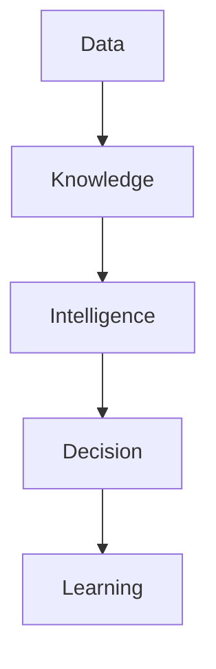

# Clara Documentation Style Guide

> *"Clear writing creates clear engineering."*

---

## Document Information

| Field | Value |
|------|-------|
| Document | Clara Documentation Style Guide |
| Version | 1.0.0 |
| Status | Official |
| Owner | Clara Core Team |
| Scope | Clara Engineering Library |
| Last Updated | 2026-07-06 |

---

# Purpose

This style guide defines how Clara documentation should be written.

The Clara Documentation Standard (ADS) defines document structure.

This style guide defines writing style.

Its goal is to make Clara documentation:

- Clear.
- Consistent.
- Professional.
- Easy to review.
- Easy to maintain.
- Easy for junior engineers to understand.
- Easy for AI coding assistants to use as reliable context.

---

# Core Writing Principle

Clara documentation should explain complex systems in simple language without oversimplifying important engineering decisions.

Good documentation should help readers understand:

- What the system is.
- Why it exists.
- How it fits into Clara.
- What decisions were made.
- What trade-offs exist.
- What future contributors must know.

---

# Language

Clara documentation should use **professional English** as the default language.

Use Bahasa Indonesia only for internal notes, mentoring material, or documents explicitly intended for Indonesian readers.

Do not mix languages inside official documents unless necessary.

---

# Tone

Use a professional, calm, and direct tone.

Clara documentation should feel like:

- AWS Well-Architected Framework.
- Microsoft Learn.
- Google Engineering Practices.
- HashiCorp documentation.
- GitLab Handbook.

Avoid writing that feels like:

- Marketing copy.
- Social media posts.
- Personal notes.
- Chat messages.
- Unreviewed brainstorming.

---

# Sentence Style

Prefer short and clear sentences.

## Good

```text
Clara treats security as architecture.
```

## Avoid

```text
Clara really strongly believes that security is something that should kind of be considered as a very important part of the system from the beginning.
```

---

# Paragraph Style

Keep paragraphs short.

A paragraph should usually contain one idea.

Prefer this:

```md
Clara treats data as organizational memory.

Data should remain useful even when applications change.
```

Avoid this:

```md
Clara treats data as organizational memory and because applications change over time, the platform should ensure that data remains useful, portable, governed, and accessible across the entire organization while also supporting future AI capabilities and analytics use cases.
```

---

# Heading Style

Use Title Case for headings.

## Correct

```md
## Data Ownership

## Security Considerations

## Future Evolution
```

## Incorrect

```md
## data ownership

## security considerations

## future evolution
```

Use headings to create a clear reading path.

Do not use vague headings like:

```md
## Misc

## Stuff

## Notes

## Things
```

---

# Document Opening

Every major document should begin with:

1. Frontmatter.
2. H1 title.
3. Opening quote.
4. Document information table.
5. Purpose section.

Example:

```md
---
book: "Book II — Master Blueprint"
title: "Executive Overview"
version: "1.0.0"
status: "draft"
owner: "Clara Core Team"
last_updated: "2026-07-06"
classification: "blueprint"
---

# Executive Overview

> *"A platform begins as a vision before it becomes architecture."*

---

## Document Information

| Field | Value |
|------|-------|
| Book | Book II — Master Blueprint |
| Chapter | 01 |
| Status | Draft |

---

## Purpose

This document explains...
```

---

# Voice

Use active voice when possible.

## Good

```text
Clara records significant system actions in the audit log.
```

## Avoid

```text
Significant system actions are recorded by Clara in the audit log.
```

Passive voice is acceptable when the actor is unknown or unimportant.

---

# Clarity Rules

Use specific words.

## Prefer

```text
The Identity Service verifies user authentication.
```

## Avoid

```text
The system handles things related to users.
```

Avoid ambiguous terms unless defined in the glossary.

Examples of ambiguous terms:

- Thing
- Stuff
- Data object
- Helper
- Manager
- Logic
- Handler
- Process

When using these terms, clarify their meaning.

---

# Technical Depth

Match the document type.

## Blueprint Documents

Blueprint documents explain **what** Clara will build.

They should avoid deep implementation details.

## Architecture Documents

Architecture documents explain **how** the system is structured.

They may include components, interfaces, boundaries, and trade-offs.

## Engineering Documents

Engineering documents explain **how to implement** safely and consistently.

They may include code patterns, testing strategy, CI/CD, and operational practices.

## Runbooks

Runbooks explain **how to operate** a system.

They should be procedural, concrete, and actionable.

---

# Avoid Vendor Lock-In Language

Official Clara documentation should avoid unnecessary dependency on specific vendors unless the document is intentionally about that vendor.

## Prefer

```text
The Model Gateway abstracts AI provider access.
```

## Avoid

```text
The system sends all AI requests to OpenAI.
```

Vendor-specific details belong in implementation documents, ADRs, or deployment guides.

---

# Explain Acronyms

Define acronyms on first use.

## Good

```text
Architecture Decision Records (ADRs) preserve the reasoning behind major technical decisions.
```

After first use, the acronym may be used.

## Avoid

```text
ADRs are required for major decisions.
```

This is only acceptable if ADR has already been defined earlier in the document or glossary.

---

# Use Consistent Terms

Use terms from `GLOSSARY.md`.

Do not invent multiple names for the same concept.

## Prefer

```text
Organization
Workspace
Tenant
Domain
Service
Event
Audit Log
```

## Avoid mixing

```text
Company / Organization / Account / Client
Space / Workspace / Environment
Log / Audit / History / Record
```

If a term has a specific meaning, define it once and use it consistently.

---

# Lists

Use bullet lists for related items.

Use numbered lists for ordered steps.

## Bullet List

```md
Clara platform services include:

- Notification.
- Search.
- Audit.
- Event Bus.
```

## Numbered List

```md
The decision process follows these steps:

1. Understand the problem.
2. Identify constraints.
3. Evaluate alternatives.
4. Document trade-offs.
```

Do not use long lists when a table would be easier to scan.

---

# Tables

Use tables for structured comparisons.

## Example

```md
| Concept | Description |
|--------|-------------|
| Data | Recorded facts |
| Knowledge | Connected data with context |
| Intelligence | Ability to apply knowledge |
```

Keep table cells short.

If a table becomes too wide, convert it into sections.

---

# Code Blocks

Use code blocks for:

- File paths.
- Commands.
- Configuration examples.
- JSON examples.
- YAML frontmatter.
- Mermaid diagrams.

Always specify the language when possible.

## Example

```yaml
status: "draft"
owner: "Clara Core Team"
```

Use plain `text` for directory structures.

```text
docs/
└── BOOK-02-Master-Blueprint/
```

---

# Mermaid Diagrams

Use Mermaid for diagrams whenever possible.

Diagrams should explain relationships, flows, dependencies, or lifecycle.

Do not create diagrams that duplicate text without adding clarity.

Keep diagram labels short.

## Example



---

# Quotes

Opening quotes are allowed and encouraged for major chapters.

Quotes should be short and relevant.

Use original Clara-style quotes unless citing external sources.

## Good

```md
> *"Architecture is the discipline of protecting future options."*
```

Avoid overly dramatic or vague quotes.

---

# Emphasis

Use emphasis sparingly.

## Use Bold For

- Important concepts.
- Official terms.
- Critical warnings.

## Use Italic For

- Quotes.
- Subtle emphasis.
- Conceptual phrases.

Avoid excessive bold text.

---

# Warnings

Use warnings for important risks.

```md
> **Warning**
>
> Never expose secrets in logs, client-side code, or error responses.
```

Use notes for helpful context.

```md
> **Note**
>
> This document defines the blueprint only. Implementation details belong in Book III.
```

---

# Security Writing Rules

Security-related sections must be explicit.

Avoid vague statements like:

```text
Security should be handled properly.
```

Prefer:

```text
Every API request must be authenticated, authorized, validated, and auditable.
```

When discussing security, consider:

- Authentication.
- Authorization.
- Input validation.
- Output encoding.
- Secrets management.
- Encryption.
- Audit logging.
- Least privilege.
- Abuse cases.
- Failure modes.

---

# AI Writing Rules

AI-related sections must preserve human authority and data boundaries.

Avoid vague statements like:

```text
AI will make the system smart.
```

Prefer:

```text
AI assists users by using authorized organizational context to summarize information, recommend actions, and support decision-making while preserving human oversight.
```

AI documents should mention:

- Context boundaries.
- Authorization.
- Explainability.
- Auditability.
- Evaluation.
- Human oversight.
- Provider independence.

---

# Product Writing Rules

Product sections should describe outcomes, not just features.

## Prefer

```text
The Workflow capability reduces repetitive operational work by allowing teams to define repeatable business processes.
```

## Avoid

```text
The Workflow module has buttons to create workflows.
```

Focus on user value and organizational impact.

---

# Architecture Writing Rules

Architecture sections should explain boundaries, responsibilities, and trade-offs.

Avoid naming technology too early.

## Prefer

```text
The Event Bus allows domains to publish meaningful business events without direct coupling.
```

## Avoid

```text
We will use Kafka for everything.
```

Technology choices belong in ADRs or implementation documents.

---

# Examples

Examples should be realistic but not overly detailed.

Use examples to clarify concepts.

Do not let examples become the main specification unless the document is an example-driven guide.

---

# Avoid Absolute Claims

Avoid claims like:

```text
This system is fully secure.
This approach is always best.
This will never fail.
```

Prefer:

```text
This approach reduces risk by limiting privilege and improving auditability.
```

Software engineering requires trade-offs.

Write with humility.

---

# Avoid Future Promises Without Scope

Do not make vague promises.

## Avoid

```text
Clara will support everything.
```

## Prefer

```text
Clara is designed to support extensible integrations through documented APIs, events, plugins, and external connectors.
```

---

# Implementation Detail Boundaries

In high-level documents, avoid:

- Framework-specific code.
- Database schema.
- Infrastructure manifests.
- Cloud-provider-specific configuration.
- Low-level optimization details.

These belong in:

- Book III — Architecture.
- Book IV — Engineering Handbook.
- TDDs.
- ADRs.
- API specs.
- Runbooks.

---

# Reviewability

Documents should be easy to review in pull requests.

To improve reviewability:

- Keep sections focused.
- Avoid huge paragraphs.
- Use stable headings.
- Avoid unrelated changes in the same pull request.
- Update changelogs when appropriate.
- Link related documents.

---

# AI-Readability

Clara documentation should be easy for AI coding assistants to understand.

To improve AI-readability:

- Use consistent structure.
- Use explicit terminology.
- Avoid hidden assumptions.
- Define dependencies clearly.
- Include scope boundaries.
- Include examples where helpful.
- Avoid ambiguous pronouns like "this", "that", or "it" when the subject is unclear.

## Good

```text
The Audit Service records significant user and system actions.
```

## Avoid

```text
It records those things.
```

---

# Recommended Section Order

Use this order for major conceptual documents:

```md
# Title

## Document Information

## Purpose

## Goals

## Scope

## Overview

## Core Concepts

## Blueprint

## Dependencies

## Risks and Considerations

## Future Evolution

## Key Takeaways

## Related Documents

## Navigation
```

Specialized documents may extend this order, but should not remove the core sections without reason.

---

# Terms to Prefer

| Prefer | Avoid |
|------|------|
| Organization | Company / Client / Account |
| Workspace | Space / Environment |
| User | Person / Member |
| Role | User Type |
| Permission | Access Flag |
| Domain | Module Group |
| Service | Manager / Helper |
| Event | Notification / Signal |
| Audit Log | History / Activity Log |
| Workflow | Process / Flow |
| AI Agent | Bot / AI Worker |
| Context | Data Around It |
| Knowledge | Information |
| Platform | App Collection |

---

# Good Documentation Checklist

Before publishing, verify:

- [ ] The purpose is clear.
- [ ] The document uses ADS structure.
- [ ] The writing is concise.
- [ ] Terms match the glossary.
- [ ] Acronyms are defined.
- [ ] The scope is explicit.
- [ ] Trade-offs are explained where relevant.
- [ ] Security implications are considered.
- [ ] AI implications are considered where relevant.
- [ ] Related documents are linked.
- [ ] Navigation is present.
- [ ] The document is easy to review.
- [ ] The document can be understood by a new contributor.

---

# Final Rule

Write documentation for the person who will maintain Clara five years from now.

That person may not know the original discussion.

They may not know why a decision was made.

They may be debugging a production incident.

They may be onboarding into the project.

They may be an AI coding assistant using documentation as context.

Write so they can understand quickly, decide safely, and continue building with confidence.

---

# Navigation

**Related Standards:**

- `ADS.md`
- `NAMING-CONVENTION.md`
- `DIAGRAM-STANDARD.md`
- `REVIEW-CHECKLIST.md`
