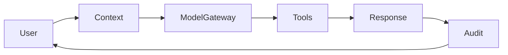

# Athena AI Specification Template

> Use this template to document an AI capability, agent, workflow, model integration, or intelligent automation within Athena.

```yaml
---
title: "<AI Capability Name>"
version: "0.1.0"
status: "draft"
owner: "<AI Team>"
classification: "ai"
last_updated: "YYYY-MM-DD"
---
```

# <AI Capability Name>

## Document Information

| Field | Value |
|---|---|
| AI Capability | <Name> |
| Owner | <Owner> |
| Version | 0.1.0 |
| Status | Draft |

---

# Purpose

Describe why this AI capability exists and what business outcome it supports.

---

# Business Value

- Problem being solved
- Expected outcome
- Success criteria

---

# Scope

## In Scope

-

## Out of Scope

-

---

# AI Capability Summary

| Attribute | Value |
|---|---|
| Capability | |
| Trigger | |
| Primary Users | |
| Human Approval Required | Yes / No |

---

# Actors

- End User
- AI Agent
- Backend Service
- Human Reviewer

---

# High-Level Workflow



---

# Context Sources

| Source | Owner | Authorization Required |
|---|---|---|
| | | |

Document:

- Context priority
- Freshness requirements
- Maximum retrieval scope

---

# Prompt Strategy

## System Prompt

Purpose and responsibilities.

## Guardrails

- Safety rule
- Business rule
- Compliance rule

## Prompt Variables

| Variable | Description |
|---|---|
| | |

---

# Model Gateway

| Property | Value |
|---|---|
| Gateway | |
| Supported Models | |
| Fallback Strategy | |

Avoid coupling conceptual documentation to a single model provider.

---

# Tool Calling

| Tool | Purpose | Permission Required |
|---|---|---|
| | | |

For each tool document:

- Inputs
- Outputs
- Side effects
- Failure handling

---

# Memory Strategy

Select applicable types:

- Stateless
- Session Memory
- Conversation Memory
- Long-Term Memory
- Knowledge Retrieval
- Cached Context

Document retention and deletion policy.

---

# Knowledge Sources

- Knowledge Base
- Documentation
- APIs
- Vector Index
- Structured Data

---

# Human Oversight

Describe:

- Approval points
- Escalation conditions
- Manual override
- Low-confidence handling

---

# Evaluation

| Metric | Target |
|---|---|
| Accuracy | |
| Latency | |
| Hallucination Rate | |
| User Acceptance | |

---

# Security Considerations

- Authentication
- Authorization
- Prompt Injection Mitigation
- Sensitive Data Handling
- Tool Permission Boundaries
- Audit Logging

---

# Privacy Considerations

- Personal Data
- Customer Data
- Data Retention
- External AI Providers
- Data Minimization

---

# Observability

- Logs
- Metrics
- Traces
- Prompt Version
- Model Version
- Tool Usage
- Safety Events

---

# Failure Modes

| Failure | Expected Behavior |
|---|---|
| Model unavailable | |
| Tool timeout | |
| Missing context | |
| Low confidence | |
| Prompt injection | |

---

# Risks & Trade-offs

| Decision | Benefit | Trade-off |
|---|---|---|
| | | |

---

# Future Evolution

Describe planned improvements.

---

# Related Documents

- Architecture
- Security Specification
- ADR
- API Specification
- Runbook
- Evaluation Plan

---

# Changelog

## 0.1.0

### Added

- Initial AI specification template.

---

# Navigation

Previous:

Next:
