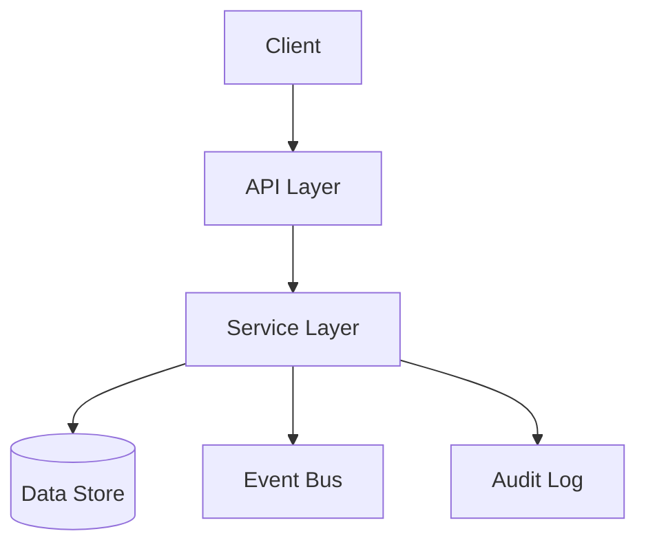
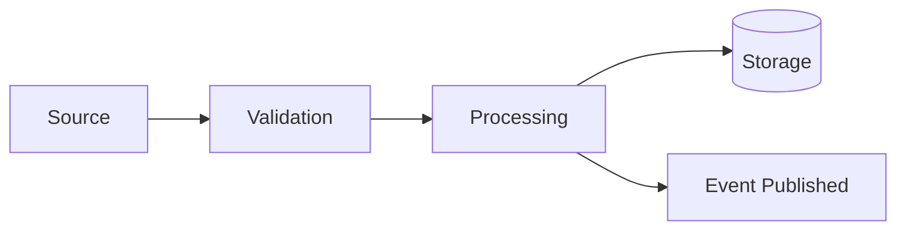
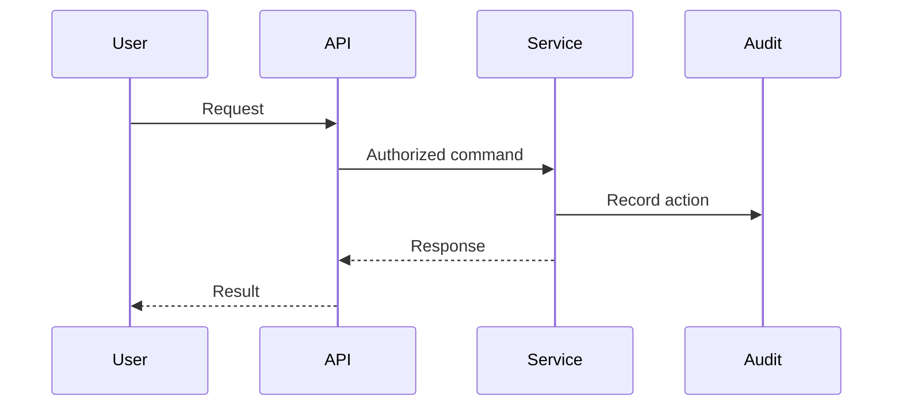

# Athena Architecture Template

> Use this template when documenting architecture decisions, system design, or technical structure within Athena.

```yaml
---
title: "<Architecture Title>"
version: "0.1.0"
status: "draft"
owner: "<Architecture Owner>"
classification: "architecture"
last_updated: "YYYY-MM-DD"
related_adr:
  - ""
---
```

# <Architecture Title>

> *"Architecture protects future options while solving present problems."*

---

# Document Information

| Field | Value |
|---|---|
| Architecture | <Architecture Title> |
| Owner | <Architecture Owner> |
| Status | Draft |
| Version | 0.1.0 |
| Related ADR | <ADR ID> |

---

# Purpose

Explain why this architecture document exists.

This section should answer:

- What system or capability is being designed?
- Why is this architecture needed?
- Which business or technical problem does it solve?
- Who should read this document?

---

# Goals

- Goal 1
- Goal 2
- Goal 3

---

# Non-Goals

Clarify what this architecture does not attempt to solve.

- Non-goal 1
- Non-goal 2

---

# Context

Describe the background, constraints, and assumptions behind this architecture.

Include:

- Business context
- Technical context
- Existing limitations
- Dependencies
- Risks

---

# High-Level Architecture



---

# Architecture Overview

Describe the major architectural components and how they relate to one another.

---

# Components

| Component | Responsibility | Owner |
|---|---|---|
| | | |

---

# Boundaries

Describe system, domain, service, trust, and data boundaries.

## Domain Boundaries

## Service Boundaries

## Trust Boundaries

## Data Boundaries

---

# Data Flow



---

# Interaction Flow

Use sequence diagrams when helpful.



---

# Dependencies

| Dependency | Purpose | Criticality |
|---|---|---|
| Identity | Authentication | High |
| Authorization | Permission checks | High |
| Audit | Accountability | High |

---

# APIs and Interfaces

Summarize public and internal interfaces.

Detailed API contracts should live in API specification documents.

---

# Events

## Events Published

- Event A
- Event B

## Events Consumed

- Event C
- Event D

---

# Data Ownership

Describe:

- Source of truth
- Owned entities
- Read models
- Cached data
- Derived data
- Data retention

---

# Security Considerations

Document:

- Authentication
- Authorization
- Tenant isolation
- Input validation
- Output safety
- Secrets
- Audit logging
- Abuse cases

---

# Privacy Considerations

Document:

- Personal data involved
- Customer data involved
- Data minimization
- Retention
- External sharing

---

# Observability

Define:

- Logs
- Metrics
- Traces
- Health checks
- Alerts
- Audit events

---

# Failure Modes

| Failure | Impact | Expected Behavior |
|---|---|---|
| Dependency unavailable | | |
| Timeout | | |
| Invalid state | | |
| Partial failure | | |

---

# Scalability Considerations

Explain:

- Expected load
- Growth assumptions
- Horizontal scaling
- Bottlenecks
- Backpressure
- Caching

---

# Performance Considerations

Explain:

- Latency targets
- Throughput targets
- Cost considerations
- Resource constraints

---

# Trade-Offs

| Option | Benefit | Trade-Off |
|---|---|---|
| | | |

---

# Alternatives Considered

Describe alternative architectures and why they were not selected.

---

# Migration Strategy

If replacing or evolving an existing system, explain:

- Migration path
- Compatibility
- Rollback
- Data migration
- Operational risks

---

# Testing Strategy

Document:

- Unit testing
- Integration testing
- Contract testing
- Security testing
- Performance testing
- Failure testing

---

# Open Questions

- Question 1
- Question 2

---

# Future Evolution

Describe how this architecture may evolve.

---

# Related Documents

- ADR
- PRD
- TDD
- API Spec
- Security Checklist
- Runbook

---

# Changelog

## 0.1.0 - YYYY-MM-DD

### Added

- Initial architecture draft.

---

# Navigation

Previous:

Next:
