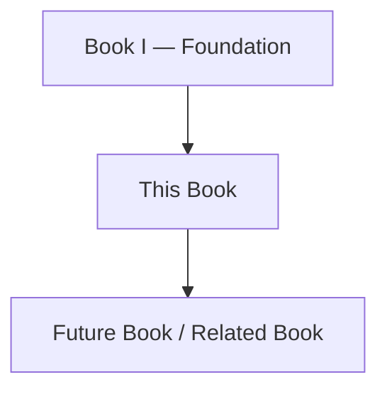

# Clara Book Template

> Use this template when creating a new official book in the Clara Engineering Library.

```yaml
---
book: "<Book Number> — <Book Title>"
title: "<Book Title>"
version: "0.1.0"
status: "draft"
owner: "<Owner>"
last_updated: "YYYY-MM-DD"
classification: "book"
previous: "<Previous Book>"
next: "<Next Book>"
---
```

# <Book Number> — <Book Title>

> *"<Opening quote that captures the purpose of this book>"*

---

# Document Information

| Field | Value |
|---|---|
| Book | <Book Number> |
| Title | <Book Title> |
| Version | 0.1.0 |
| Status | Draft |
| Owner | <Owner> |
| Classification | Book |

---

# Purpose

Explain why this book exists within the Clara Engineering Library.

This section should answer:

- What does this book define?
- Who should read it?
- What decisions or work should reference it?
- How does it relate to other Clara books?

---

# Audience

This book is intended for:

- <Audience 1>
- <Audience 2>
- <Audience 3>

---

# Relationship to Other Books

Explain how this book connects to the rest of the Clara Engineering Library.

```text
Book I  → Why Clara exists
Book II → What Clara will build
Book III → How Clara is architected
Book IV → How Clara is engineered
Book V → How Clara AI works
Book VI → How Clara is operated
Book VII → How Clara product evolves
Book VIII → How Clara ecosystem grows
```

---

# Book Scope

## In Scope

- Topic A
- Topic B
- Topic C

## Out of Scope

- Topic X
- Topic Y

---

# Book Structure

```text
<BOOK-FOLDER>/
├── README.md
├── SUMMARY.md
├── GLOSSARY.md
├── CHANGELOG.md
├── PART-01-Example/
├── PART-02-Example/
├── assets/
├── diagrams/
├── metadata/
└── references/
```

---

# Part Map

| Part | Title | Purpose |
|---|---|---|
| PART-01 | <Part Title> | <Purpose> |
| PART-02 | <Part Title> | <Purpose> |
| PART-03 | <Part Title> | <Purpose> |

---

# Reading Order

1. PART-01
2. PART-02
3. PART-03

---

# Dependency Map



---

# Key Principles

List the principles that govern this book.

- Principle 1
- Principle 2
- Principle 3

---

# Deliverables

This book may produce or influence:

- PRDs
- TDDs
- Architecture specs
- API specs
- Security checklists
- Test plans
- Runbooks
- ADRs

---

# Governance

Explain how changes to this book should be reviewed.

Consider:

- Required reviewers
- Versioning
- Changelog requirements
- ADR requirements
- Security review requirements

---

# Security Considerations

Summarize security topics relevant to this book.

---

# AI Considerations

Summarize AI-related topics relevant to this book, if any.

---

# Future Evolution

Describe how this book may evolve over time.

---

# Key Takeaways

- Key point 1
- Key point 2
- Key point 3

---

# Related Documents

- ../standards/ADS.md
- ../standards/STYLE-GUIDE.md
- ../standards/NAMING-CONVENTION.md
- ../standards/REVIEW-CHECKLIST.md

---

# Changelog

## 0.1.0 - YYYY-MM-DD

### Added

- Initial book draft.

---

# Navigation

**Previous Book:** <Previous Book>

**Next Book:** <Next Book>
