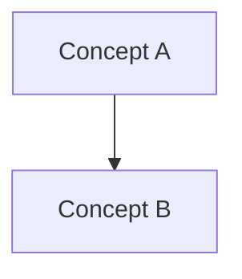

# Clara Chapter Template

> Copy this template when creating a new official Clara chapter.

---

```yaml
---
book: "<Book Name>"
part: "<Part Name>"
chapter: "<Chapter Number>"
title: "<Chapter Title>"
version: "0.1.0"
status: "draft"
owner: "<Owner>"
last_updated: "YYYY-MM-DD"
classification: "<blueprint|architecture|product|security|ai|operations>"
previous: ""
next: ""
---
```

# <Chapter Title>

> *"<Relevant architectural quote>"*

---

## Document Information

| Field | Value |
|---|---|
| Book | <Book Name> |
| Part | <Part Name> |
| Chapter | <Chapter Number> |
| Status | Draft |
| Owner | <Owner> |

---

# Purpose

Describe why this chapter exists.

---

# Goals

- Goal 1
- Goal 2
- Goal 3

---

# Scope

## In Scope

-

## Out of Scope

-

---

# Overview

Provide a concise overview of the topic.

---

# Core Concepts

Explain the primary concepts introduced in this chapter.

---

# Architecture / Blueprint

Use Mermaid where appropriate.



---

# Responsibilities

Describe the responsibilities of the capability or concept.

---

# Dependencies

- Dependency A
- Dependency B

---

# Security Considerations

- Authentication
- Authorization
- Data Protection
- Auditability

---

# Risks and Trade-offs

| Decision | Benefit | Trade-off |
|---|---|---|
| | | |

---

# Future Evolution

Describe expected future improvements.

---

# Key Takeaways

- Key point 1
- Key point 2
- Key point 3

---

# Related Documents

- ../README.md
- ../GLOSSARY.md
- <Related Chapter>

---

# References

- Internal ADRs
- Standards
- External references (when appropriate)

---

# Changelog

## 0.1.0 - YYYY-MM-DD

### Added

- Initial draft.

---

# Navigation

**Previous:** <Previous Chapter>

**Next:** <Next Chapter>
