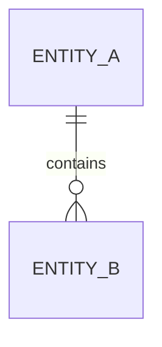

# Clara Database Specification Template

> Use this template to document database design, schema evolution, and data ownership for Clara services and domains.

```yaml
---
title: "<Database Specification>"
version: "0.1.0"
status: "draft"
owner: "<Engineering Team>"
classification: "database-spec"
last_updated: "YYYY-MM-DD"
related_prd: ""
related_tdd: ""
related_adr: []
---
```

# <Database Specification>

## Document Information

| Field | Value |
|---|---|
| Component | <Name> |
| Owner | <Engineering Team> |
| Version | 0.1.0 |
| Status | Draft |

---

# Purpose

Explain the database design and the business capability it supports.

---

# Scope

## In Scope

-

## Out of Scope

-

---

# Related Documents

- PRD
- TDD
- Architecture Specification
- API Specification
- ADR(s)

---

# Data Ownership

| Entity | Owner | Source of Truth |
|---|---|---|
| | | |

Document which service owns each entity.

---

# ER Diagram



---

# Schema Overview

| Table | Purpose |
|---|---|
| | |

---

# Table Specification

## <Table Name>

### Columns

| Column | Type | Nullable | Description |
|---|---|---|---|
| | | | |

### Constraints

- Primary Key
- Foreign Keys
- Unique Constraints
- Check Constraints

### Indexes

| Index | Purpose |
|---|---|
| | |

---

# Relationships

Describe one-to-one, one-to-many, and many-to-many relationships.

---

# Migration Strategy

- Initial migration
- Backward compatibility
- Rollback strategy
- Data migration plan

---

# Multi-Tenancy

Document:

- Tenant identifier
- Workspace identifier
- Isolation strategy
- Row-level security (if applicable)

---

# Audit Fields

Recommended fields:

- id
- created_at
- updated_at
- created_by
- updated_by
- deleted_at (soft delete)
- version (optimistic locking)

---

# Data Lifecycle

Document:

- Creation
- Updates
- Archival
- Retention
- Deletion
- Recovery

---

# Security Considerations

- Data classification
- Encryption at rest
- Encryption in transit
- Sensitive columns
- Access control
- Secrets handling

---

# Performance

Document:

- Expected row growth
- Index strategy
- Partitioning
- Query optimization
- Caching considerations

---

# Backup & Recovery

- Backup frequency
- Restore objectives
- Recovery testing

---

# Testing

- Migration tests
- Constraint validation
- Performance benchmarks
- Backup/restore verification

---

# Risks & Trade-Offs

| Risk | Mitigation |
|---|---|
| | |

---

# Open Questions

- Question 1
- Question 2

---

# Changelog

## 0.1.0

### Added

- Initial database specification template.

---

# Navigation

Previous:

Next:
