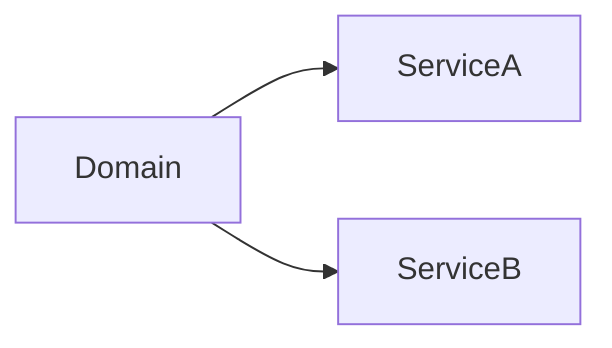

# Clara Domain Template

> Use this template when documenting a Business Domain within Clara.

```yaml
---
title: "<Domain Name>"
version: "0.1.0"
status: "draft"
owner: "<Domain Owner>"
classification: "domain"
last_updated: "YYYY-MM-DD"
---
```

# <Domain Name>

> *"A domain represents a business capability, not a technical module."*

---

# Document Information

| Field | Value |
|---|---|
| Domain | <Domain Name> |
| Owner | <Domain Owner> |
| Status | Draft |
| Version | 0.1.0 |

---

# Purpose

Describe the business capability this domain owns.

---

# Business Problem

What organizational problem does this domain solve?

---

# Goals

- Goal 1
- Goal 2
- Goal 3

---

# Scope

## In Scope

-

## Out of Scope

-

---

# Business Capabilities

| Capability | Description |
|---|---|
| | |

---

# Core Entities

| Entity | Description |
|---|---|
| | |

---

# Responsibilities

List everything this domain owns.

---

# Domain Boundaries

Describe what belongs inside and outside this domain.

---

# Interactions



---

# Events

### Publishes

- Event A

### Consumes

- Event B

---

# Dependencies

- Identity
- Authorization
- Audit
- Event Bus

---

# Security Considerations

- Authentication
- Authorization
- Tenant isolation
- Auditability

---

# AI Considerations

Describe AI usage within this domain.

---

# Risks and Trade-offs

| Decision | Benefit | Trade-off |
|---|---|---|
| | | |

---

# KPIs

- KPI 1
- KPI 2

---

# Future Evolution

Describe expected roadmap.

---

# Related Documents

- Architecture
- API Specification
- PRD
- ADRs

---

# Changelog

## 0.1.0

### Added

- Initial draft.

---

# Navigation

Previous Domain:

Next Domain:
