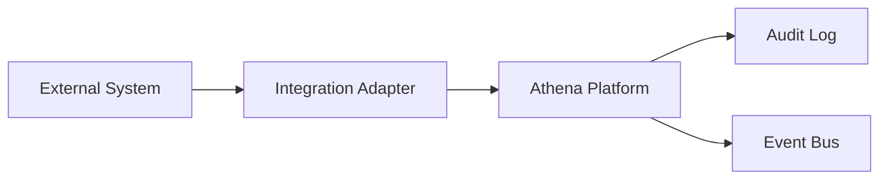

# Athena Integration Specification Template

> Use this template to document integrations between Athena and external systems, providers, plugins, channels, or third-party APIs.

```yaml
---
title: "<Integration Name>"
version: "0.1.0"
status: "draft"
owner: "<Integration Owner>"
classification: "integration-spec"
last_updated: "YYYY-MM-DD"
related_prd: ""
related_tdd: ""
related_adr: []
---
```

# <Integration Name>

## Document Information

| Field | Value |
|---|---|
| Integration | <Integration Name> |
| Owner | <Integration Owner> |
| Version | 0.1.0 |
| Status | Draft |

---

# Purpose

Explain why this integration exists and what business capability it enables.

---

# Integration Summary

| Field | Value |
|---|---|
| External System | <Provider / Platform> |
| Integration Type | REST / GraphQL / Webhook / OAuth / SDK / File Sync / Event Stream |
| Direction | Inbound / Outbound / Bidirectional |
| Criticality | Low / Medium / High / Critical |

---

# Business Use Case

Describe the user or business scenario supported by this integration.

---

# Scope

## In Scope

-

## Out of Scope

-

---

# Related Documents

- PRD
- TDD
- Architecture Specification
- API Specification
- Security Specification
- ADR(s)
- Runbook

---

# External System Overview

Describe the external system.

Include:

- Provider name
- API documentation reference
- Environment separation
- Sandbox availability
- Rate limit model
- Versioning policy

---

# Authentication

Document:

- Authentication method
- OAuth scopes
- API key usage
- Token storage
- Token refresh
- Token rotation
- Revocation behavior

---

# Authorization

Document what the integration is allowed to access.

| Capability | Permission / Scope | Required |
|---|---|---|
| | | |

Apply least privilege.

---

# Data Flow



---

# Inbound Data

| Source Field | Athena Field | Required | Transformation |
|---|---|---|---|
| | | | |

---

# Outbound Data

| Athena Field | External Field | Required | Transformation |
|---|---|---|---|
| | | | |

---

# Sync Strategy

Choose one or more:

- Real-time webhook
- Polling
- Scheduled sync
- Manual sync
- Event-driven sync
- Batch import/export

Document:

- Frequency
- Ordering
- Conflict handling
- Deduplication
- Backfill strategy

---

# Webhooks

## Incoming Webhooks

| Event | Description | Verification |
|---|---|---|
| | | |

## Outgoing Webhooks

| Event | Destination | Retry Policy |
|---|---|---|
| | | |

---

# Events

## Events Published

- Event A
- Event B

## Events Consumed

- Event C
- Event D

---

# Idempotency

Document how duplicate requests, retries, and repeated webhook deliveries are handled.

---

# Error Handling

| Error | Expected Behavior |
|---|---|
| Authentication failure | |
| Authorization failure | |
| Rate limited | |
| Timeout | |
| Invalid payload | |
| Provider unavailable | |

---

# Retry Policy

Document:

- Retry count
- Backoff strategy
- Dead-letter handling
- Manual replay
- Alerting

---

# Rate Limiting

Document:

- Provider limits
- Athena limits
- Throttling strategy
- User-facing behavior

---

# Security Considerations

Document:

- Signature verification
- Token protection
- Tenant isolation
- Input validation
- Output safety
- Secrets management
- Audit logging
- Abuse cases

---

# Privacy Considerations

Document:

- Personal data exchanged
- Customer data exchanged
- External provider transmission
- Retention policy
- Deletion behavior
- Consent requirements

---

# Observability

Document:

- Logs
- Metrics
- Traces
- Sync status
- Failure dashboard
- Alert thresholds
- Audit events

---

# Testing

- Sandbox tests
- Contract tests
- Webhook signature tests
- Retry tests
- Rate limit tests
- Security tests
- End-to-end tests

---

# Rollout Plan

- Feature flag
- Pilot users
- Sandbox validation
- Production rollout
- Rollback plan

---

# Risks & Trade-Offs

| Risk | Impact | Mitigation |
|---|---|---|
| | | |

---

# Open Questions

- Question 1
- Question 2

---

# Future Evolution

Describe planned improvements, provider version upgrades, or additional integration capabilities.

---

# Changelog

## 0.1.0

### Added

- Initial integration specification template.

---

# Navigation

Previous:

Next:
