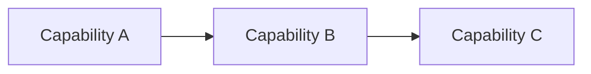

# Athena Part Template

> Use this template for every official Part in an Athena book.

```yaml
---
book: "<Book Name>"
part: "<PART-XX Name>"
title: "<Part Title>"
version: "0.1.0"
status: "draft"
owner: "<Owner>"
last_updated: "YYYY-MM-DD"
classification: "part"
chapters:
  - "01-Example-Chapter.md"
---
```

# <Part Title>

> *"Every great system is built one capability at a time."*

---

# Document Information

| Field | Value |
|---|---|
| Book | <Book Name> |
| Part | <PART-XX Name> |
| Status | Draft |
| Owner | <Owner> |

---

# Purpose

Explain why this Part exists and what area of Athena it covers.

---

# Goals

- Define the capability area.
- Connect related chapters.
- Provide a consistent learning path.

---

# Scope

## In Scope

- Capability A
- Capability B

## Out of Scope

- Implementation details
- Low-level APIs (unless this Part is API-focused)

---

# Part Overview

Provide a high-level summary of the Part.

---

# Learning Outcomes

After reading this Part, the reader should understand:

- Primary concepts
- Relationships between chapters
- Architectural significance

---

# Chapter Map

| Chapter | Title | Purpose |
|---|---|---|
| 01 | Example Chapter | Introduce the topic |

---

# Capability Map



---

# Dependencies

- Related Books
- Related Parts
- Global Standards

---

# Security Considerations

Summarize security topics relevant to this Part.

---

# AI Considerations

Summarize AI-related implications, if applicable.

---

# Risks and Trade-offs

| Decision | Benefit | Trade-off |
|---|---|---|
| | | |

---

# Future Evolution

Describe how this Part is expected to evolve.

---

# Reading Order

1. Chapter 01
2. Chapter 02
3. Chapter 03

---

# Related Documents

- ../README.md
- ../SUMMARY.md
- ../../standards/ADS.md

---

# Changelog

## 0.1.0 - YYYY-MM-DD

### Added

- Initial Part template.

---

# Navigation

**Previous Part:** <Previous Part>

**Next Part:** <Next Part>
