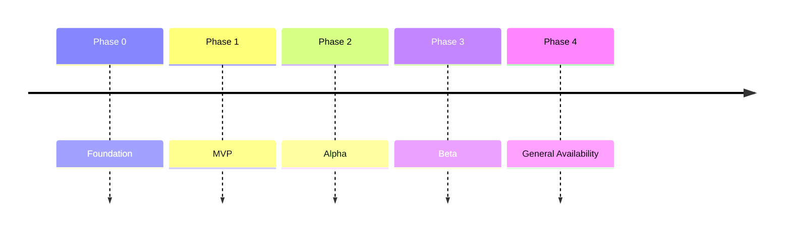

# Athena Roadmap Template

> Use this template to define strategic direction, milestones, release phases, dependencies, and success metrics for Athena initiatives.

```yaml
---
title: "<Roadmap Name>"
version: "0.1.0"
status: "draft"
owner: "<Roadmap Owner>"
classification: "roadmap"
last_updated: "YYYY-MM-DD"
time_horizon: "<Quarter / Half / Year / Multi-Year>"
---
```

# <Roadmap Name>

## Document Information

| Field | Value |
|---|---|
| Roadmap | <Name> |
| Owner | <Roadmap Owner> |
| Version | 0.1.0 |
| Status | Draft |
| Time Horizon | <Time Horizon> |

---

# Purpose

Explain why this roadmap exists and what strategic direction it defines.

---

# Strategic Context

Describe the background and connection to Athena's vision, mission, and blueprint.

---

# Goals

- Goal 1
- Goal 2
- Goal 3

---

# Non-Goals

- Non-goal 1
- Non-goal 2

---

# Success Metrics

| Metric | Target | Measurement Method |
|---|---|---|
| | | |

---

# Stakeholders

| Role | Name / Team | Responsibility |
|---|---|---|
| Product | | |
| Engineering | | |
| Security | | |
| AI | | |
| Operations | | |

---

# Roadmap Overview



---

# Phases

## Phase 0 — Foundation

### Objective

Describe the phase objective.

### Deliverables

- Deliverable 1
- Deliverable 2

### Exit Criteria

- [ ] Criteria 1
- [ ] Criteria 2

---

## Phase 1 — MVP

### Objective

Describe the phase objective.

### Deliverables

- Deliverable 1
- Deliverable 2

### Exit Criteria

- [ ] Criteria 1
- [ ] Criteria 2

---

# Milestones

| Milestone | Target Date | Owner | Status |
|---|---|---|---|
| | | | Planned |

---

# Dependencies

| Dependency | Owner | Risk |
|---|---|---|
| | | |

---

# Risks and Mitigations

| Risk | Impact | Mitigation |
|---|---|---|
| | | |

---

# Scope by Release

| Release | Scope | Notes |
|---|---|---|
| v0.1 | | |
| v0.2 | | |
| v1.0 | | |

---

# Security Considerations

Document security work required across roadmap phases.

---

# AI Considerations

Document AI capabilities, governance, evaluation, and safety milestones.

---

# Operational Readiness

Document:

- Monitoring
- Runbooks
- Incident response
- Backup and recovery
- Scaling readiness

---

# Communication Plan

Document:

- Stakeholder updates
- Release notes
- Internal demos
- Customer communication

---

# Decision Log

| Date | Decision | Reference |
|---|---|---|
| | | ADR / PRD / TDD |

---

# Future Evolution

Describe how this roadmap may evolve after the current time horizon.

---

# Related Documents

- Book I — The Foundation
- Book II — Master Blueprint
- PRDs
- TDDs
- ADRs
- Runbooks

---

# Changelog

## 0.1.0

### Added

- Initial roadmap template.

---

# Navigation

Previous:

Next:
