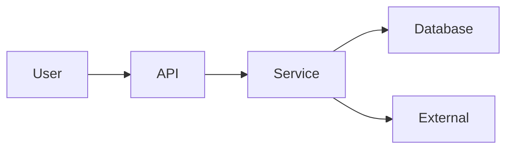

# Athena Security Specification Template

> Use this template to document the security model for a service, domain, API, integration, AI capability, or infrastructure component.

```yaml
---
title: "<Security Specification>"
version: "0.1.0"
status: "draft"
owner: "<Security Owner>"
classification: "security"
last_updated: "YYYY-MM-DD"
---
```

# <Security Specification>

## Document Information

| Field | Value |
|---|---|
| Component | <Name> |
| Owner | <Owner> |
| Version | 0.1.0 |
| Status | Draft |

---

# Purpose

Describe what is being protected and why.

---

# Scope

## In Scope

-

## Out of Scope

-

---

# Assets

| Asset | Classification | Owner |
|---|---|---|
| | | |

---

# Trust Boundaries



Describe each trust boundary and required validation.

---

# Authentication

- Identity provider
- Session/token type
- MFA requirements
- Service authentication

---

# Authorization

| Action | Required Permission | Notes |
|---|---|---|
| | | |

Include role model, least privilege, and tenant/workspace isolation.

---

# Data Protection

- Data classification
- Encryption at rest
- Encryption in transit
- Backup
- Retention
- Deletion policy

---

# Secrets Management

Document:

- Secret source
- Rotation strategy
- Access policy
- Storage mechanism

Never include real secrets.

---

# Input Validation

Document validation rules for:

- APIs
- Forms
- Imports
- Webhooks
- AI prompts
- File uploads

---

# Output Protection

- XSS prevention
- HTML encoding
- Sensitive field masking
- Error response policy

---

# Audit & Logging

Record:

- Security events
- Administrative actions
- Authentication events
- Authorization failures

---

# Threat Model

| Threat | Risk | Mitigation |
|---|---|---|
| | | |

Reference STRIDE, OWASP, or other methodology if applicable.

---

# Abuse Cases

- Abuse Case 1
- Abuse Case 2
- Abuse Case 3

---

# Security Controls

| Control | Description | Status |
|---|---|---|
| | | Planned |

---

# Compliance

Identify applicable requirements:

- Privacy
- Regulatory
- Internal policy
- Customer commitments

---

# Incident Response

Document:

- Detection
- Escalation
- Containment
- Recovery
- Postmortem

---

# Security Testing

- SAST
- DAST
- Dependency scanning
- Penetration testing
- Threat simulation
- Manual review

---

# Risks & Assumptions

List accepted risks and assumptions.

---

# Open Questions

- Question 1
- Question 2

---

# Related Documents

- Architecture
- API Specification
- ADR
- Runbook
- AI Specification

---

# Changelog

## 0.1.0

### Added

- Initial security specification template.

---

# Navigation

Previous:

Next:
