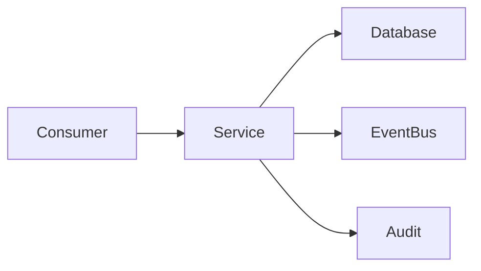

# Clara Service Template

> Use this template when documenting a reusable Platform Service within Clara.

```yaml
---
title: "<Service Name>"
version: "0.1.0"
status: "draft"
owner: "<Service Owner>"
classification: "service"
last_updated: "YYYY-MM-DD"
---
```

# <Service Name>

> *"Platform services provide reusable capabilities shared across multiple domains."*

---

# Document Information

| Field | Value |
|---|---|
| Service | <Service Name> |
| Owner | <Service Owner> |
| Status | Draft |
| Version | 0.1.0 |

---

# Purpose

Explain why this service exists and which platform capability it provides.

---

# Responsibilities

- Responsibility 1
- Responsibility 2
- Responsibility 3

---

# Goals

- High availability
- Secure by default
- Reusable across domains
- Observable and maintainable

---

# Scope

## In Scope

-

## Out of Scope

-

---

# Consumers

| Consumer | Purpose |
|---|---|
| Domain A | |
| Domain B | |

---

# Service Capabilities

| Capability | Description |
|---|---|
| | |

---

# Inputs

- API Requests
- Events
- Scheduled Jobs

---

# Outputs

- Events
- API Responses
- Notifications
- Logs
- Metrics

---

# High-Level Architecture



---

# Dependencies

- Identity Service
- Authorization Service
- Event Bus
- Audit Service
- Configuration Service

---

# Public Interfaces

## REST / GraphQL

| Endpoint | Purpose |
|---|---|
| | |

## Events Published

- Event A

## Events Consumed

- Event B

---

# Data Ownership

Describe the data owned by this service and identify the source of truth.

---

# Security Considerations

## Authentication

## Authorization

## Tenant Isolation

## Secrets Management

## Audit Requirements

---

# Observability

Document:

- Logs
- Metrics
- Traces
- Health checks
- Alerts

---

# Failure Modes

| Failure | Expected Behavior |
|---|---|
| Dependency unavailable | |
| Timeout | |
| Invalid input | |

---

# Performance Expectations

- Latency target
- Throughput target
- Scalability expectations

---

# Risks and Trade-offs

| Decision | Benefit | Trade-off |
|---|---|---|
| | | |

---

# Future Evolution

Describe planned improvements and long-term roadmap.

---

# Related Documents

- Domain Specification
- Architecture Specification
- API Specification
- ADRs
- Runbook

---

# Changelog

## 0.1.0

### Added

- Initial service template.

---

# Navigation

Previous Service:

Next Service:
