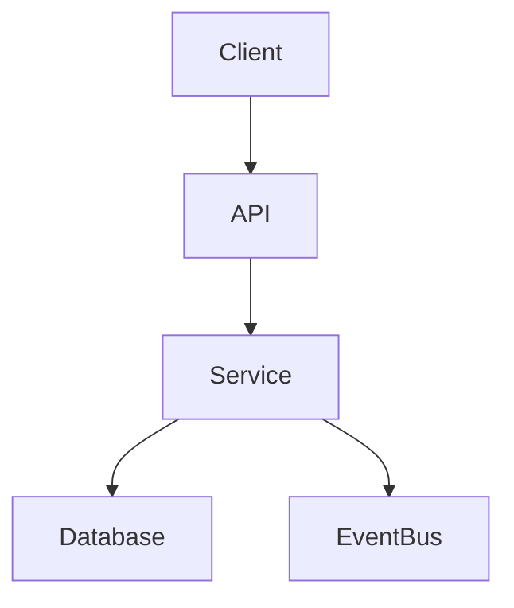

# Clara Technical Design Document (TDD) Template

> Use this template to describe **how** a product or feature will be implemented after the PRD is approved.

```yaml
---
title: "<Feature / System Name>"
version: "0.1.0"
status: "draft"
owner: "<Engineering Team>"
classification: "tdd"
last_updated: "YYYY-MM-DD"
related_prd: ""
related_adr: []
---
```

# <Feature / System Name>

## Document Information

| Field | Value |
|---|---|
| Feature | <Name> |
| Owner | <Engineering Team> |
| Version | 0.1.0 |
| Status | Draft |

---

# Purpose

Explain the implementation approach and technical design.

---

# Goals

- Implement approved PRD
- Meet non-functional requirements
- Maintain security and scalability

## Non-Goals

- Items intentionally excluded

---

# Related Documents

- PRD
- ADR(s)
- Architecture Specification
- API Specification
- Security Specification

---

# Requirements Mapping

| PRD Requirement | Technical Solution |
|---|---|
| FR-001 | |

---

# High-Level Design



---

# Components

| Component | Responsibility |
|---|---|
| API | |
| Service | |
| Worker | |
| Database | |

---

# Data Model

Reference the Database Specification.

Summarize key entities and relationships.

---

# API Design

Reference the API Specification.

List new or changed endpoints.

---

# Integration Design

Document external systems, events, queues, webhooks, or third-party dependencies.

---

# State & Workflow

Describe business flow and lifecycle.

Include Mermaid diagrams if useful.

---

# Error Handling

Document:

- Validation failures
- Retries
- Timeouts
- Idempotency
- Dead-letter handling
- User-facing errors

---

# Security Design

Describe:

- Authentication
- Authorization
- Input validation
- Output encoding
- Secrets management
- Audit logging
- Tenant isolation

---

# Performance Considerations

- Expected load
- Latency target
- Scalability strategy
- Caching
- Background processing

---

# Observability

- Logging
- Metrics
- Tracing
- Alerts
- Health checks

---

# Testing Strategy

- Unit Tests
- Integration Tests
- Contract Tests
- Performance Tests
- Security Tests
- End-to-End Tests

---

# Deployment Strategy

- Feature flags
- Backward compatibility
- Rollout plan
- Rollback plan

---

# Risks & Trade-Offs

| Risk | Mitigation |
|---|---|
| | |

---

# Open Questions

- Question 1
- Question 2

---

# Acceptance Checklist

- [ ] PRD mapped
- [ ] Architecture reviewed
- [ ] Security reviewed
- [ ] API documented
- [ ] Test strategy defined
- [ ] Rollback defined

---

# Changelog

## 0.1.0

### Added

- Initial TDD template.

---

# Navigation

Previous:

Next:
