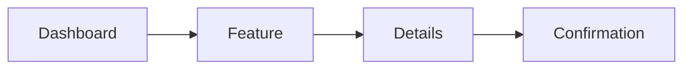

# Clara UX Specification Template

> Use this template to define the user experience, interaction flows, and interface behavior before UI implementation begins.

```yaml
---
title: "<Feature / Screen Name>"
version: "0.1.0"
status: "draft"
owner: "<Design Team>"
classification: "ux-spec"
last_updated: "YYYY-MM-DD"
related_prd: ""
related_tdd: ""
---
```

# <Feature / Screen Name>

## Document Information

| Field | Value |
|---|---|
| Feature | <Name> |
| Owner | <Design Team> |
| Version | 0.1.0 |
| Status | Draft |

---

# Purpose

Describe the user experience this specification defines.

---

# Design Goals

- Simple
- Accessible
- Efficient
- Consistent
- Secure

---

# Users

| Persona | Goal |
|---|---|
| | |

---

# User Journey

Describe the end-to-end journey.

---

# User Stories

- As a ...
- I want ...
- So that ...

---

# Information Architecture

```text
Page
├── Section A
├── Section B
└── Section C
```

---

# Navigation Flow



---

# Screen Inventory

| Screen | Purpose | Entry Point |
|---|---|---|
| | | |

---

# Wireframe Notes

For each screen document:

- Layout
- Primary actions
- Secondary actions
- Empty state
- Loading state
- Error state
- Success state

---

# Components

| Component | Purpose |
|---|---|
| Button | |
| Table | |
| Form | |

---

# Forms

For each form specify:

- Fields
- Validation
- Required fields
- Default values
- Error messages

---

# Interaction Rules

Document:

- Click behavior
- Keyboard shortcuts
- Responsive behavior
- Pagination
- Sorting
- Filtering

---

# Accessibility

- WCAG considerations
- Keyboard navigation
- Screen reader support
- Color contrast
- Focus management

---

# Responsive Design

Document expected behavior for:

- Desktop
- Tablet
- Mobile

---

# Security UX

Document UX for:

- Authentication
- Authorization failures
- Session expiration
- Confirmation dialogs
- Sensitive actions

---

# Error Handling

| Scenario | User Feedback |
|---|---|
| Validation error | |
| Network failure | |
| Permission denied | |

---

# Success Criteria

Define measurable UX outcomes.

---

# Analytics

Track:

- Key events
- Funnel steps
- Drop-off points
- Success events

---

# Related Documents

- PRD
- TDD
- API Specification
- Test Plan

---

# Changelog

## 0.1.0

### Added

- Initial UX specification template.

---

# Navigation

Previous:

Next:
